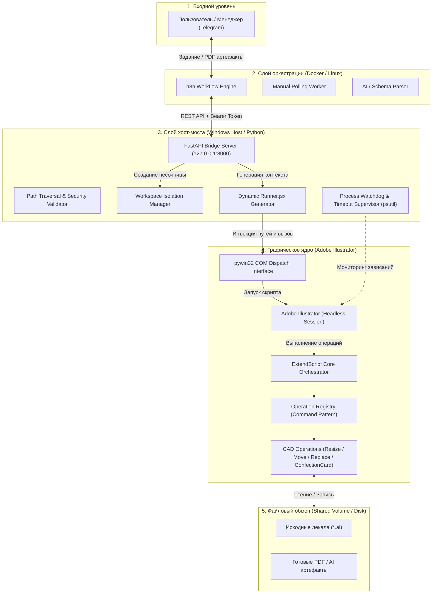
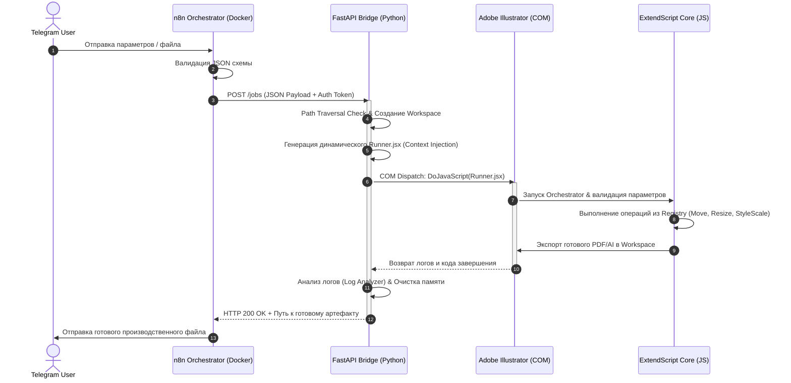

# 👔 Clothing CAD Automation: Headless Adobe Illustrator Pipeline

[](https://python.org)
[](https://fastapi.tiangolo.com)
[](https://developer.adobe.com/illustrator/scripting/)
[](https://n8n.io)
[](https://docker.com)
[](https://diataxis.fr)

> **Автономный агентный конвейер для промышленного редактирования лекал и автоматизации графических CAD-процессов в Adobe Illustrator без участия человека.**

Система превращает настольное приложение Adobe Illustrator в масштабируемый сервис пакетной обработки чертежей и конфекционных карт. Пайплайн принимает задания из Telegram, валидирует параметры по JSON-схемам, выполняет векторные операции через собственный ExtendScript-движок и возвращает готовые производственные артефакты (PDF/AI).

---

## 🏗️ Архитектура системы (System Design)

Система построена на гетерогенной трехуровневой архитектуре с изоляцией сред исполнения:



---

## ⚡ Жизненный цикл задачи (Data Flow & Sequence)



---

## 🚀 Ключевые инженерные решения

* **Context Injection Strategy (Изоляция путей):** ExtendScript-ядро не занимается самообнаружением путей. Python-мост транслирует абсолютные пути песочницы непосредственно в генерируемый `Runner.jsx`, предотвращая коллизии при параллельных вызовах.
* **Process Watchdog & Early Exit (`psutil`):** Защита от зависания однопоточного COM-сервера Illustrator. При превышении таймаута воркер корректно перехватывает процесс, завершает сессию и предотвращает блокировку всей очереди.
* **Path Traversal Protection (`security.py`):** Все входящие пути к компонентам и шаблонам проходят строгую нормализацию и проверку выхода за пределы рабочей директории.
* **Паттерн Registry в ExtendScript:** Модульное расширение графических операций без модификации ядра. Новая операция добавляется изолированным файлом в `src/operations/` и регистрируется в `operationRegistry.js`.
* **Fail-Fast валидация схем (`schemas/`):** JSON-схемы верифицируются дважды: на уровне Pydantic-моделей в Python и на уровне JS-валидатора перед выполнением трансформаций лекал.
* **Работа без внешнего белого IP (Manual Polling):** Контур n8n работает в закрытой корпоративной сети без открытия входящих портов наружу.

---

## 📂 Структура репозитория

```text
illustrator-automation/
├── bridge/                     # Python FastAPI сервис управления Illustrator
│   ├── services/
│   │   ├── illustrator.py      # COM-интерфейс (pywin32) и генератор раннеров
│   │   └── workspace.py        # Управление изолированными песочницами задач
│   ├── utils/
│   │   ├── log_analyzer.py     # Парсер ExtendScript-логов выполнения
│   │   └── security.py         # Защита от Path Traversal
│   ├── config.py               # Pydantic Settings конфигурация
│   ├── models.py               # Pydantic схемы валидации задач
│   └── main.py                 # FastAPI приложение и эндпоинты
├── src/                        # ExtendScript (ES3) ядро для Adobe Illustrator
│   ├── core/                   # Оркестратор и диспетчер команд
│   ├── operations/             # Модули CAD-операций (Move, Resize, Replace, ConfectionCard)
│   ├── schemas/                # JSON-схемы валидации команд
│   └── utils/                  # Модули инспекции, конвертеры единиц (pt/mm/in), масштабирование стилей
├── dev/                        # Тестовый контур, фикстуры лекал (*.ai) и интеграционные тесты
├── docs/                       # Документация по стандарту Diátaxis
│   ├── 00_architecture/        # Системный дизайн, модель безопасности и потоки данных
│   ├── 01_n8n/                 # Спецификация и инструкции узлов n8n
│   ├── 02_bridge/              # Спецификация FastAPI моста
│   ├── 03_extendscript/        # Спецификация ExtendScript ядра
│   └── 04_ai_integration/     # Промпты и системные инструкции ИИ-агента
├── docker-compose.yml.example  # Пример оркестрации n8n в контейнере
└── requirements.txt            # Зафиксированные зависимости Python
```

---

## ⚡ Быстрый старт (Локальное развертывание)

### 1. Подготовка окружения Моста (Windows Host)

Для взаимодействия с Adobe Illustrator через COM-интерфейс Python-мост запускается непосредственно на хост-машине:

```powershell
# Клонирование репозитория
git clone https://github.com/Curr3ncyV01D/illustrator-automation.git
cd illustrator-automation

# Настройка виртуального окружения
python -m venv venv
.\venv\Scripts\activate
pip install -r requirements.txt

# Настройка конфигурации
cp .env.example .env
```

Заполните `.env`:
```env
BRIDGE_API_KEY=your_secure_api_key_here
HOST=127.0.0.1
PORT=8000
```

Запуск сервиса моста:
```powershell
uvicorn bridge.main:app --host 127.0.0.1 --port 8000
```

### 2. Запуск n8n в Docker

```bash
cp docker-compose.yml.example docker-compose.yml
docker compose up -d
```

1. Откройте интерфейс n8n: `http://localhost:5678`.
2. Импортируйте воркфлоу из папки проекта.
3. Укажите `BRIDGE_API_KEY` и Telegram Bot Credentials.
4. Активируйте сценарий (кнопка **Publish**).

---

## 📚 Документация (Методология Diátaxis)

Документация проекта полностью организована по международному фреймворку **Diátaxis**:

| Раздел | 📖 Справочники (Reference) | 🛠️ Инструкции (How-to) | 🧠 Концепции (Explanation) |
| :--- | :--- | :--- | :--- |
| **00. Архитектура** | [Глоссарий](./00_architecture/glossary.md) | - | [System Big Picture](./00_architecture/big_picture.md) |
| **01. Оркестратор n8n** | [Спецификация n8n](./01_n8n/reference.md) | [Сброс очереди задач](./01_n8n/how_to.md) | [Manual Polling стратегия](./01_n8n/explanation.md) |
| **02. Python Bridge** | [API & Models](./02_bridge/reference.md) | [Запуск тестов](./02_bridge/how_to.md) | [Handshake & IPC](./02_bridge/explanation.md) |
| **03. ExtendScript Core** | [Реестр операций](./03_extendscript/reference.md) | [Создание новых CAD-операций](./03_extendscript/how_to.md) | [Паттерн Registry в ES3](./03_extendscript/explanation.md) |

### Системные спецификации
* [Потоки данных и синхронизация (Data Flow)](./00_architecture/data_flow.md)
* [Жизненный цикл задачи (Task Lifecycle)](./00_architecture/lifecycle.md)
* [Модель безопасности песочницы (Security Model)](./00_architecture/security_model.md)
* [Системный промпт ИИ-агента](./04_ai_integration/ai_system_prompt.md)

---

## 🛠️ Стек технологий

* **Оркестрация и воронка:** `n8n`, `Telegram Bot API`
* **Бэкенд моста:** `Python 3.11+`, `FastAPI`, `Pydantic v2`, `pywin32 (COM)`, `psutil`
* **Графическое ядро:** `Adobe Illustrator (Headless)`, `ExtendScript (ECMAScript 3)`
* **Контейнеризация и окружение:** `Docker`, `Docker Compose`
